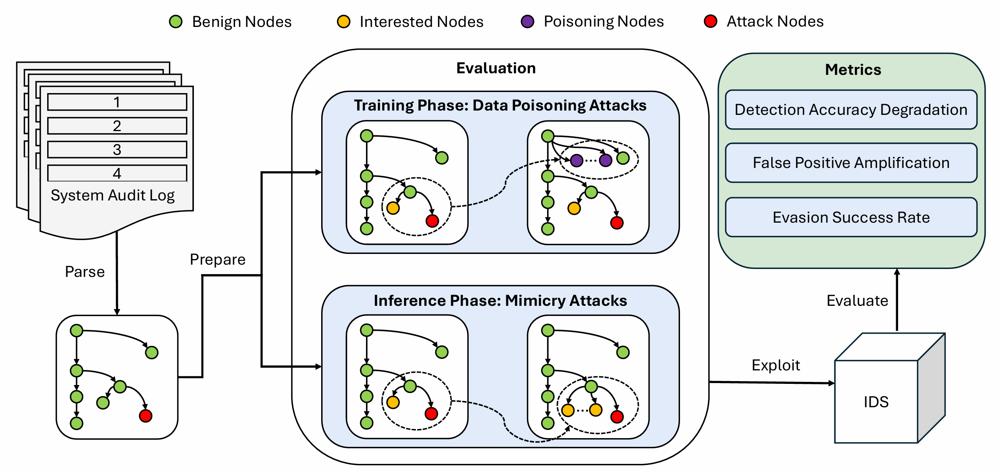

# Evaluation: A Comprehensive Testbed for Evaluating the Robustness of Endpoint Detection


**Evaluation**: a comprehensive, data-driven testbed for evaluating the robustness of endpoint detection systems under adversarial conditions. It is designed to model two distinct but realistic adversarial strategies:

* **Data poisoning attacks** targeting the **training phase**, and
* **Mimicry attacks** targeting the **inference phase**.

These attack models represent key threat vectors that adversaries can exploit to either degrade the learning of endpoint detection or bypass detection during runtime.

**Evaluation** further introduces a principled methodology, including:

* Three robustness metrics: **Detection Accuracy Degradation (DAD)**, **False Positive Amplification (FPA)**, and **Evasion Success Rate (ESR)**
* An **estimated metric benchmarking** method to contextualize results

We use Evaluation to analyze two representative endpoint detection paradigms:

* **Sequence-based endpoint detection**, evaluated using [Airtag](https://github.com/dhl123/Airtag-2023)
* **Provenance-based endpoint detection**, evaluated using [MAGIC](https://github.com/FDUDSDE/MAGIC)

Our results show that even state-of-the-art endpoint detection solutions are highly vulnerable to straightforward adversarial scenarios simulated by Evaluation, posing a significant threat to the integrity of the critical systems they are intended to protect.

---

## Installation

Evaluation requires Python 3.7+ and NumPy:

```bash
pip install numpy
```

---

## Dataset Preparation

### 1. DARPA CDM Dataset (Example: `trace`)

* Place CDM JSON event files (e.g., `ta1-trace-e3-official-1.json`, `*.1`, `*.2`, etc.) under `dataset/trace/`.
* Place the label file `lable.txt` in the same directory. Each line should contain a line number (starting from 1) corresponding to a known malicious event.

### 2. ATLAS Dataset (Example: S1 Subset)

* Place `firefox.txt`, `dns`, and the NumPy label file `S1_number_.npy` (containing 0-based indices of malicious lines) under `dataset/S1/logs/`.

### 3. Benign Event/Process Dictionary (Optional)

* To filter candidate benign events by a predefined dictionary, create `event_dictionary.txt` in the root directory. Each line should list a benign process or event name.

### 4. **Custom Dataset Support**

Evaluation allows easy integration with any custom dataset by providing your own Python parser.

* Place your custom logs under `dataset/custom/` (any format you like).
* Implement a parser function named `parse_custom_dataset(custom_dir)` in `custom_parser.py` (in the project root).
* This function should return a list of `(event_dict, label)` pairs (label: `0` for benign, `1` for malicious\`).
* See `custom_parser.py` for an example template.

---

## Running Evaluation

Evaluation supports three modes:

* `train`: inject poisoning samples into the training set
* `infer`: inject adversarial samples into the test set (mimicry attack)
* `both`: combine both types of attacks

### Basic usage:

```bash
python evaluation.py --dataset trace --num 500 --mode both
```

### Arguments:

* `--dataset`  Dataset name: `trace` for DARPA, `S1` for ATLAS S1, or `custom` for your dataset
* `--num`    Number of events to inject (e.g., 100–1000)
* `--split`   Training/test split ratio (default: 0.7)
* `--mode`   Evaluation mode: `train`, `infer`, or `both`
* `--dict_filter` (Optional) Only use benign events from `event_dictionary.txt`

### Example Commands:

* **DARPA, 500 poisoned events, using dictionary filtering:**

```bash
python evaluation.py --dataset trace --num 500 --mode both --dict_filter
```

* **ATLAS S1, test set evasion only:**

```bash
python evaluation.py --dataset S1 --num 300 --mode infer
```

* **Custom dataset, 200 poisoned events:**

```bash
python evaluation.py --dataset custom --num 200 --mode train
```

---

## Output Details

* **DARPA (trace):**

* Outputs: `evaluation_train.json` and `evaluation_test.json`

* Format: standard CDM JSON Lines

* **ATLAS S1:**

* Outputs native-format logs under `dataset/S1/logs/`:

* `evaluation_train_firefox.txt`, `evaluation_train_dns`

* `evaluation_test_firefox.txt`, `evaluation_test_dns`

* **Custom dataset:**

* Outputs: `evaluation_train.json` and `evaluation_test.json` in your custom data folder

* Format: each line is a JSON event as returned by your parser

These outputs are fully compatible with endpoint detection pipelines such as MAGIC and Airtag.

---

## Using MAGIC, Airtag, or Your Own Endpoint Detection

Evaluation is designed for seamless integration with any endpoint detection pipeline.
**Built-in support for:**

* [MAGIC (FDUDSDE)](https://github.com/FDUDSDE/MAGIC)
* [Airtag (DHL123)](https://github.com/dhl123/Airtag-2023)

### 1. Running MAGIC

* Follow the MAGIC repo instructions for training/testing.
* Save the console output containing:

```
TN: ...
FN: ...
TP: ...
FP: ...
```

into:

* `magic_result.txt` (attacked output)
* `magic_baseline.txt` (clean baseline)

### 2. Running Airtag

* Follow the Airtag repo instructions for execution.
* Save the test result block like:

```
test1
<TP>
<FN>
<FP>
<TN>
```

into:

* `airtag_result.txt` (attacked output)
* `airtag_baseline.txt` (clean baseline)

### 3. **Running Your Own Endpoint Detection**

Evaluation outputs are standard JSON lines or text logs.

* You can plug any endpoint detection or anomaly detector into the Evaluation workflow.
* For custom metrics, you can script your own evaluation using the output files.

---

## Calculating Metrics

```bash
python magic_eval.py
python airtag_eval.py
# or your own script for custom endpoint detection
```

### Sample Output:

```
=== magic Metrics ===
DAD: 0.012345
FPA: 0.058230
ESR: 0.003210
```

---

## Official References

* [MAGIC GitHub](https://github.com/FDUDSDE/MAGIC)
* [Airtag GitHub](https://github.com/dhl123/Airtag-2023)

---

**Evaluation: A comprehensive, reproducible, and scalable framework for stress-testing endpoint detection robustness.**
